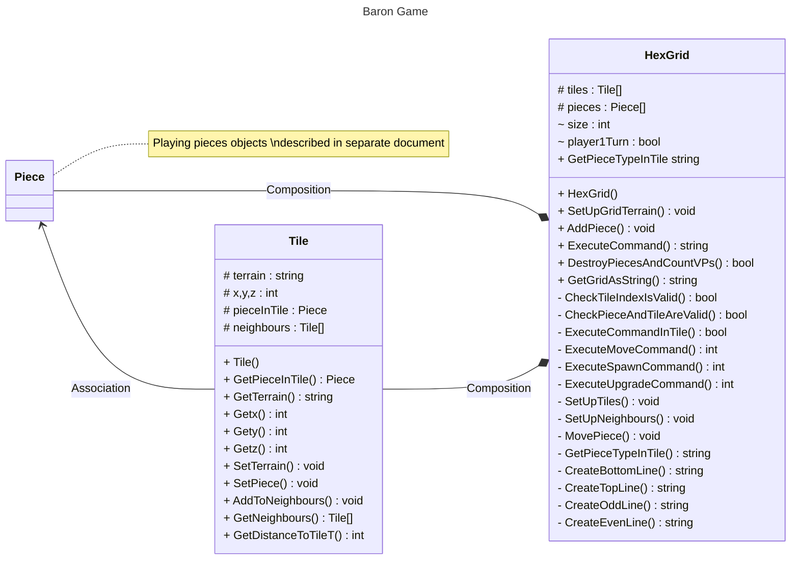

# <a id="top">Documentation of HexGrid and Tile Classes</a>  

[Main Document](./programAnalysis.md)

The **[Tile](#tile)** class stores the details of one individual board tile.  
The **[HexGrid](#hexgrid)** represents the entire playing board.    



## <a id="tile">Tile</a>
The **Tile** object represent a specific tile on the playing board. 

As part of that it has properties to represent the x, y and z coordinates and the terrain type of that tile.

To facilitate game functionality it also has a list which has pointers to the objects for all the neighbouring tiles.
If there is a playing piece in the tile this can be referenced through the pieceInTile property.

The *id* of the tile is not held as a property but instead is the list index in the **HexGrid** object that the tile is in. 

**Methods**  
- [Get and Set Methods](#getset-methods)  
- [Constructor](#constructor-method)
- [GetDistanceToTileT](#getdistancetotilet)
- [AddToNeighbours](#addtoneighbours)
  
    
*[Return to top](#top)*  
  

### Properties
|Name|Type|Scope|Description|Initial Value|
|----|----|-----|-----------|-------------|
|terrain|string|protected|terrain of tile (clear/peat/forest)|*space*|
|x|int|protected|x coordinate of tile on board|constructor|
|y|int|protected|y coordinate of tile on board|constructor|
|z|int|protected|z coordinate of tile on board|constructor|
|pieceInTile|Piece|protected|Reference to **Piece** object in tile, null if empty|null|
|neighbours|Tile[]|protected|List with references to **Tile** objects which neighbour this tile|null|

_constructor parameter indicates a parameter to the constructor sets the initial valuex.  Other values set directly inside the constructor_

### Get/Set Methods
The following *get* methods are available to access the private/protected properties.  None accept parameters and all return the same datatype as their associated property  
- Getx()
- Gety()
- Getz()
- GetTerrain()
- GetNeighbours()
- GetPieceInTile()

The following *set* methods are available to update the private/protected properties.  
- SetPiece (piece : Piece)
- SetTerrain (terrain : string)
  
*[Return to Tile Methods](#tile)*
  

### Constructor Method
**Tile**
This method is the **constructor** method for the class  
|Parameters|||
|----|----|-----|   
|xcoord |int| x coordinate of tile on board|
|ycoord |int| y coordinate of tile on board|
|zcoord |int| z coordinate of tile on board|

|Returns|
|----|   
|null |
  
*[Return to Tile Methods](#tile)*

### Methods
#### **GetDistanceToTileT**
|Parameters|||
|----|----|-----|   
|t |Tile| Tile to calculate distance to from this tile|

|Returns||
|----|-----|   
|int |Distance to tile|


Calculates the distance between this **Tile** and the one passed as a parameter 

If tiles are t1 and t2 then calculation is   
*&emsp;max ( |t1.x - t2.x|  , |t1.y - t2.y|, |t1.z - t2.z|   )*


#### **AddToNeighbours**
|Parameters|||
|----|----|-----|   
|n |Tile|Reference to Tile object to add to list of neighbours|

|Returns|
|----|   
|null |  

Add reference to **Tile** passed as parameter into property **neighbours** 
  
*[Return to Tile Methods](#tile)*

*[Return to top](#top)*  

## <a id="hexgrid">HexGrid</a>  

The HexGrid is the object that represents the playing board.  The key data held within this object is
- List of the **Tile** objects
- List of the **Piece** objects representing the playing pieces

The index of a **Tile** in the tiles list is also that **Tile** ID "property" which is heavily utilised
  
  *[Return to Tile Methods](#tile)*
  
  *[Return to top](#top)*  

**Methods**  
- [Get/Set Method](#getset-methods-1)
- [Constructor](#constructor-method-1)
- [Methods to set up board](#methods-to-setup-the-board)
- [Methods to Execute player command](#methods-for-executing-player-commands)
- [Method for End of turn processing](#methods-to-process-end-of-turn)
- [Methods to Output screen for Console](#methods-for-outputing-the-board-display)

### Properties
|Name|Type|Scope|Description|Initial Value|
|----|----|-----|-----------|-------------|
|tiles|Tile[]|protected|List of references to the **Tile** object of this **HexGrid**|Constructor|  
|pieces|Piece[]|protected|List of references to all the **Piece** objects in the game |Empty list|
|size|int|protected|Total size of board in tiles|Constructor|
|player1Turn|bool|protected|True if player 1 turn/False for player 2|True|

_constructor indicates a parameter to the constructor sets the initial valuex.  Other values set directly inside the constructor_

### Get/Set Methods  
The following *get* methods are available to access the private/protected properties.  None accept parameters and all return the same datatype as their associated property  
- GetPieceTypeInTile(ID : int)  //ID is the index of a tile

The following *set* methods are available to update the private/protected properties.  

*[Return to HexGrid Methods](#hexgrid)*

### Constructor Method
**HexGrid**
This method is the **constructor** method for the class  
|Parameters|||
|----|----|-----|   
|n |int|Total size of board in tiles|

|Returns|
|----|   
|null |  

The constructor will always set the **player1Turn** property to *true* to indicate the next player to go will be player 1.

It then uses 2 other private methods
- SetUpTiles
- SetUpNeighbours()
to initialise the other object properties correctly.  
       
*[Return toHexGrid Methods](#hexgrid)*

### Methods to Setup the Board
**SetUpGridTerrain**

Scope: Public

|Parameters|||
|----|----|-----|   
|listOfTerrain |string[]|list with terrain for each **Tile** represented by a string  |

|Returns||
|----|-----|   
|void||  

The terrain types are represented by a char
|char|Terrain type|Resource|
|----|----|-----|   
|*space* |Open / No Terrain|
|#|Forest|Lumber|
|~|Peat bog | Fuel|

**AddPiece**

Scope: Public

|Parameters|||
|----|----|-----|   
|belongsToPlayer1 |bool|indicate if piece belongs to Player 1 (True) or Player 2 (False)  |
|typeOfPiece |string|Type of Piece|
|location |int|ID of **Tile** piece is in|


|Returns||
|----|-----|   
|void||  

Method will create a new **Piece** object and add it to the **tiles[]** list (see object properties).  

|Values for typeOfPiece|Class to create|
|----|----|
|Baron|BaronPiece|
|LESS|LESSPiece|
|PBDS|PBDSPiece|
|*any other value*|Piece (Serf)|
  
**SetUpTiles**
 
Scope: Private  
|Parameters|||
|----|----|-----|   
|void |||


|Returns||
|----|-----|   
|void||  

Sets up the playing board by creating all the **Tile** objects required and adding them into the list **tiles** which is an object property.  As **Tile** are created their x,y,z coordinates are calculated.  

As it is a hex board it uses 3 coordinates (x,y,z).  If you consider the board as rows and columns then you can think of the *columns* as being vertical and the *rows* as staggered with the next hex along alternating between slightly below and slightly above its predecessor.   

Each row is then split into *odd* and *even* x coordinates with the even part of the row slightly above the odd part.  

The *height* of the board is half the width so if size is 8 the board consists of a 8 x 4 hex.

```
evenStartZ = 0
oddStartZ = 0
evenStartY = 0
oddStartY = -1

//Main loop down the Grid
FOR count = 1 to self.size / 2
    //create 2 rows at a time
    //create the even row
    y=evenStartY
    z=evenStartZ
    FOR x = 0 TO self.size STEP 2       //x will increment 2 per iteration
        
        //create new Tile and append to tiles list
        tempTile = new Tile(x,y,z)
        tiles.Add(tempTile)
        y = y -1
        z = z - 1

    END FOR
    //change starting values for Z and X for next iteration
    evenStartZ = evenStartZ + 1
    evenStartY = evenStartY - 1

    //create the odd row
    y=oddStartY
    z=oddStartZ
    FOR x = 1 TO self.size-1 STEP 2       //x will increment 2 per iteration
        
        //create new Tile and append to tiles list
        tempTile = new Tile(x,y,z)
        tiles.Add(tempTile)
        y = y -1
        z = z - 1


    END FOR
    //change starting values for Z and X for next iteration
    evenStartZ = evenStartZ + 1
    evenStartY = evenStartY - 1

ENDFOR
```

**SetUpNeighbours**  

Scope: Private
|Parameters|||
|----|----|-----|   
|void |||


|Returns||
|----|-----|   
|void||  

The process exhaustively checks each **Tile** against every other **Tile** and finds the *distance* between them,  if it is 1 (eg they are touching) then it adds it to the list property **neighbours** on that **Tile** . 

```
//Iterate through all tiles on the board
FOR EACH fromTile in self.tiles

    //Iterate through all tiles on the board
    FOR EACH toTile in self.tiles
        //If fromTile and toTile are touching
        IF fromTile.GetDistanceToTileT(toTile)= 1 THEN
            fromTile.AddToNeighbours(toTile)
        ENDIF

    ENDFOR

ENDFOR
```

*[Return toHex Grid Methods](#hexgrid)*
  
#### **Methods for executing player commands**
**ExecuteCommand**
|Parameters|||
|----|----|-----|   
|items|string[]|List with ONE commands to be processed.  Each element has 1 "word" from command|
|fuelChange|int|**By Ref** used to **return** any new change to players fuel|
|lumberChange|int|**By Ref** used to **return** any new change to players lumber|
|supplyChange|int|**By Ref** used to **return** any new change to players supply of pieces|
|fuelAvailable|int|How much fuel player has available BEFORE command executed|
|lumberAvailable|int|How much lumber player has available BEFORE command executed|
|piecesInSupply|int|How much supply pieces player has available BEFORE command executed|


|Returns||
|----|-----|   
|string|Text description describing outcome of Command being processed  |  

Method processes a single command.  The command is passed in as a list with each element of the list having one word from the command e.g.
Move 2 4
would come in as a list  

|Index|Value
|-----|-----
| 0 |Move
| 1 |2
| 2 |4  

The supplies of fuel, lumber and piece available are passed in as one set of parameters and then any change to this resulting from the command passed back to the called routine using **ref** parameters.  

**Pseudo code**
```
SWITCH items[0]     //command word 
    CASE "move"
        fuelCost = ExecuteMoveCommand(items, fuelAvailable)
        IF fuelCost < 0 THEN        //move command failed
            RETURN "That move can't be done"
        ENDIF
        //if you get here move succeeded
        fuelChange = fuelCost * -1
    CASE "saw" OR "dig"
        IF NOT ExecuteCommandInTile(items, REF fuelChange, REF lumberChange) THEN
            //command failed
            RETURN "Couldn't do that"
        ENDIF
        //if you get to here command must have succeeded
    CASE "spawn"            // add new piece
        lumberCost= ExecuteSpawnCommand(items, lumberAvailable, piecesInSupply)
        IF lumberCost < 0 THEN          //spawn failed
            RETURN "Spawning did not occur"
        ENDIF
        //if you get here the spawn succeeded
        lumberChange = lumberCost * -1
        supplyChange = 1
    CASE "upgrade"          //upgrade serf to LESS or PBDS
        lumberCost = ExecuteUpgradeCommand(items, lumberAvailable)
        IF lumberCost < 0 THEN          //upgrade failed
            RETURN "Upgrade not possible"
        ENDIF
        //if you get here the upgrade succeeded
        lumberChange = lumberCost * -1
END CASE

//To get here the command succeeded as it did not hiy an explicit RETURN inside the switch
RETURN "Command executed"
```
**ExecuteMoveCommand**  
  
Scope: Private
  
|Parameters|||
|----|----|-----|  
|items|string[]|details of move command to execute|

|Returns||
|----|-----|
|int|Cost of move in fuel|  

**Pseudo code**  
SR works by check all possible reasons why move is NOT possible and returns early with fail code if they are.  If no issues then move carried out and cost returned to calling SR

```
//check if start and end locations are valid
IF NOT CheckPieceAndTileAreValid(startID) OR NOT CheckTileIndexIsValid(endID) THEN
    RETURN -1       //failed move
ENDIF
thePiece = tiles[startID]           //get piece object to be moved

//check the tile being moved to is empty
IF tiles[endID].GetPieceInTile() != null THEN
    RETURN -1       //failed move
ENDIF

//calculate the cost of the move in fuel and
//check it is a valid move (distance/terrain for that piece)
distance = tiles[startID].GetDistanceToTileT(tiles[endID])
fuelCost = thePiece.CheckMoveIsValid(distance, tiles[startID].GetTerrain(), tiles[endID].GetTerrain())

//if move impossible fuelCost will be -1
//check that player has enough fuel for move
IF fuelCost = -1 OR fuelAvailable < fuelCost THEN
    RETURN -1       //failed move
ENDIF

//If all checks are passed then move is valid so carry it out
//and pass back to calling SR cost of move in fuel
MovePiece(endID, startID)
RETURN fuelCost
```  

**MovePiece**  
  
Scope: Private

|Parameters|||
|----|----|-----|   
|newIndex|int|Grid ID to move piece to|
|oldIndex|int|Grid ID the piece is currently in|  

|Returns||
|----|-----|   
|void| |  

This method does no validation of the move as this is all carried out in the calling SR **ExecuteMoveCommand**. It
- Set **piece** property in newIndex **Tile** to the  **piece** currently in oldIndex **Tile**
- Set **piece** property in oldIndex **Tile** to null

**CheckTileIndexIsValid**
  
Scope: Private

|Parameters|||
|----|----|-----|   
|TileToCheck |int|index value to **tiles** List|

|Returns||
|----|-----|   
|bool |indicate if index passed is valid for this **HexGrid** |

 
**CheckTileIndexIsValid**
  
Scope: Private  

|Parameters|||
|----|----|-----|    
|tileToCheck|int|Index to **tile[]** of tile being checked|

|Returns||
|----|-----|   
|bool|Is tile Index valid for this **HexGrid** object|   

Checks if index > 0 and < size of HexGrid  
  
  **CheckPieceAndTileAreValid**  
  
Scope: Private

|Parameters|||
|----|----|-----|    
|tileToUse|int|Index to **tile[]** of tile being checked|

|Returns||
|----|-----|   
|bool|Is tile Index valid for this **HexGrid** object|  

**Pseudo Code**  
```
IF CheckTileIndexIsValid(tileToUse) THEN

    thePiece = tiles[tileToUse].GetPieceInTile()
    //check there is actually a piece on this tile
    IF thePiece != null THEN 

        //check the piece belongs to current player
        IF thePiece.GetBelongsToPlayer1() == player1Turn THEN
            //move is Valid
            RETURN True
        ENDIF

    ENDIF

ENDIF

//Move is NOT valid
RETURN False
```
       
*[Return to HexGrid Methods](#hexgrid)*

### Methods to Process end of turn

**DestroyPiecesAndCountVPs**  
|Parameters|||
|----|----|-----|    
|player1VPs|int|Number of victory points for Player 1.  Passed by **ref** so it can be updated within method|
|player2VPs|int|Number of victory points for Player 2.  Passed by **ref** so it can be updated within method|

|Returns||
|----|-----|   
|bool|Has one (or both) baron pieces been destroyed and therefore the game will end|   

End of player turn processing.  Loops through each **Tile** which as a piece on it and checks to see if it needs to be *destroyed* 

**Pseudo code**
```
baronDestroyed = False                      //this is also the RETURN variable
listOfTilesContainingDestroyedPieces = []   //List that will hold references to any piece destroyed  

//Loop through all the tiles on the HexGrid 
FOR EACH t IN tiles  
    
    //check to see if piece in tile,
    IF t.GetPieceInTile != null THEN                //piece in that Tile

        //Check through all the neighbours of the Tile to and count how many a piece in them 
        listOfNeighbours = t.GetNeighbours
        noOfConnections = 0
        FOR EACH n IN listOfNeighbours
            IF n.GetPieceInTile != null THEN        //piece in that Tile
                noOfConnections ++
            ENDIF
        END FOR

        //Check to see if piece show be marked to be destroyed
        thePiece = t.GetPieceInTile()
        IF noOFConnections >= thePiece.GetConnectionsneededToDestroy() THEN
            //mark piece as destroyed
            thePiece.DestroyPiece()

            //check if piece is one of the Barons
            IF thePiece.GetPieceType() = "B" THEN
                baronDestroyed = True           //This will be the RETURN value
            ENDIF

            //Update the Victory points
            IF thePiece.GetBelongsToPlayer1()=True THEN
                player2VPs = player2VPs + thePiece.GetVPs()
            ELSE
                player1VPs = player1VPs + thePiece.GetVPs()
            ENDIF
        ENDIF

    ENDIF
END FOR

//Now remove any destroyed pieces from board using list listOfTilesContainingDestroyedPieces  
FOR EACH t IN listOfTilesContainingDestroyedPieces
    t.SetPiece(null)            //Remove the piece from "board" so tile will now be empty
ENDFOR

RETURN baronDestroyed
```
       
*[Return to HexGrid Methods](#hexgrid)*

### Methods for outputing the board display  
In order to output the board display to the console a **HexGrid** object can return the board as a single (fairly complex) string variable.  This variable will include all the CR/LF neccesary so can just be output with a single simple *Console.WriteLine* command

The methods are
- GetGridAsString() - Public
- CreateBottomLine()
- CreateTopLine()
- CreateOddLine()
- CreateEvenLine() 

**GetGridAsString** is called and in turns calls the other (private) methods as needed to build a single string variable called *gridAsString* which is then returned to the called SR.  

       
*[Return to HexGrid Methods](#hexgrid)*

*[Return to top](#top)* 