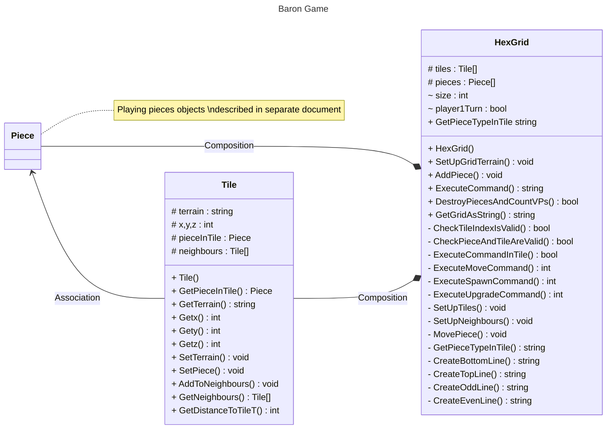

# <a id="top">Documentation of HexGrid and Tile Classes</a>  

The **[Tile](#tile)** class stores the details of one individual board tile.  The **[HexGrid](#hexgrid)** represents the entire playing board.    

## <a id="tile">Tile</a>
The **Tile** object represent a specific tile on the playing board. 

As part of that it has properties to represent the x, y and z coordinates and the terrain type of that tile.

To facilitate game functionality it also has a list which has pointers to the objects for all the neighbouring tiles.
If there is a playing piece in the tile this can be referenced through the pieceInTile property.

The *id* of the tile is not held as a property but instead is the list index in the **HexGrid** object that the tile is in. 

### Properties
|Name|Type|Scope|Description|Initial Value|
|----|----|-----|-----------|-------------|
|terrain|string|protected|terrain of tile (clear/peat/forest)|*space*|
|x|int|protected|x coordinate of tile on board|constructor|
|y|int|protected|y coordinate of tile on board|constructor|
|z|int|protected|z coordinate of tile on board|constructor|
|pieceInTile|Piece|protected|Reference to **Piece** object in tile, null if empty|null|
|neighbours|Tile[]|protected|List with references to **Tile** objects which neighbour this tile|null|

_constructor parameter indicates a parameter to the constructor sets the initial valuex.  Other values set directly inside the constructor_

### Get/Set Methods
The following *get* methods are available to access the private/protected properties.  None accept parameters and all return the same datatype as their associated property  
- Getx()
- Gety()
- Getz()
- GetTerrain()
- GetNeighbours()
- GetPieceInTile()

The following *set* methods are available to update the private/protected properties.  
- SetPiece (piece : Piece)
- SetTerrain (terrain : string)

### Constructor Method
**Tile**
This method is the **constructor** method for the class  
|Parameters|||
|----|----|-----|   
|xcoord |int| x coordinate of tile on board|
|ycoord |int| y coordinate of tile on board|
|zcoord |int| z coordinate of tile on board|

|Returns|
|----|   
|null |

### Methods
**GetDistanceToTileT**
|Parameters|||
|----|----|-----|   
|t |Tile| Tile to calculate distance to from this tile|

|Returns||
|----|-----|   
|int |Distance to tile|

**AddToNeighbours**
|Parameters|||
|----|----|-----|   
|n |Tile|Reference to Tile object to add to list of neighbours|

|Returns|
|----|   
|null |  
*[Return to top](#top)*  

## <a id="hexgrid">HexGrid</a>  

The HexGrid is the object that represents the playing board.  The key data held within this object is
- List of the **Tile** objects
- List of the **Piece** objects representing the playing pieces

The index of a **Tile** in the tiles list is also that **Tile** ID "property" which is heavily utilised

### Properties
|Name|Type|Scope|Description|Initial Value|
|----|----|-----|-----------|-------------|
|tiles|Tile[]|protected|List of references to the **Tile** object of this **HexGrid**|Constructor|  
|pieces|Piece[]|protected|List of references to all the **Piece** objects in the game |Empty list|
|size|int|protected|Total size of board in tiles|Constructor|
|player1Turn|bool|protected|True if player 1 turn/False for player 2|True|

_constructor indicates a parameter to the constructor sets the initial valuex.  Other values set directly inside the constructor_

### Get/Set Methods  
The following *get* methods are available to access the private/protected properties.  None accept parameters and all return the same datatype as their associated property  
- GetPieceTypeInTile(ID : int)  //ID is the index of a tile

The following *set* methods are available to update the private/protected properties.  

### Constructor Method
**HexGrid**
This method is the **constructor** method for the class  
|Parameters|||
|----|----|-----|   
|n |int|Total size of board in tiles|

|Returns|
|----|   
|null |  

The constructor will always set the **player1Turn** property to *true* to indicate the next player to go will be player 1.

It then uses 2 other private methods
- SetUpTiles
- SetUpNeighbours()
to initialise the other object properties correctly.

### Public Methods
**SetUpGridTerrain**
|Parameters|||
|----|----|-----|   
|listOfTerrain |string[]|list with terrain for each **Tile** represented by a string  |

|Returns||
|----|-----|   
|void||  

The terrain types are represented by a char
|char|Terrain type|Resource|
|----|----|-----|   
|*space* |Open / No Terrain|
|#|Forest|Lumber|
|~|Peat bog | Fuel|

### Private Methods
**CheckTileIndexIsValid**
|Parameters|||
|----|----|-----|   
|TileToCheck |int|index value to **tiles** List|

|Returns||
|----|-----|   
|bool |indicate if index passed is valid for this **HexGrid** |

*[Return to top](#top)* 