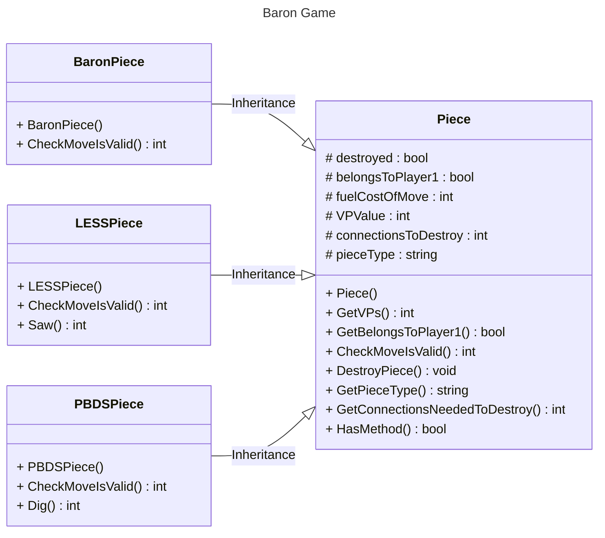

# <a id="top">Documentation of Classes used for playing pieces </a>
Piece is a base class which has child classes associated with it.  Each different piece type has its own class.



- Serf : [Piece](#piece)
- Baron: [BaronPiece](#baronpiece)
- LESS: [LESSPiece](#lesspiece)
- PBDS: [PBDSPiece](#pbdspiece)

The majority of piece functionality is defined within the parent **Piece** class.  Actions only available to specific pieces are defined within a child class.   

|Piece|Class|PieceType Code|
|-----|-----|--------------|
|Serf|Piece|"S"|
|Baron|BaronPiece|"B"|
|LESS (Lumber)|LessPiece|"L"|
|PBDS (Peat)|PBDSPiece|"P"|

## <a id="piece">Piece</a> (used for Serf and as Base for other piece classes)

### Properties

|Name|Type|Scope|Description|Initial Value|
|----|----|-----|-----------|-------------|
|destroyed|bool|protected|Indicates if piece is active (F) or destroyed (T)|false|
|belongsToPlayer1|bool|protected|Player 1 piece (T) Player 2 (F)|constructor parameter|
|fuelCostOfMove|int|protected|Cost of moving piece to next hex|1|
|VPValue|int|protected|Value to opposite player of destroying piece|1|
|connectionsToDestroy|int|protected|How many neighbouring hexes with pieces with destroy piece|2|
|pieceType|string|protected|Type of piece|"S"|
||||||

_constructor parameter indicates a parameter to the constructor sets the initial valuex.  Other values set directly inside the constructor_

### Get/Set Methods
The following *get* methods are available to access the private/protected properties.  None accept parameters and all return the same datatype as their associated property
- GetVPs
- GetBelongsToPlayer1
- GetConnectionsNeededToDestroy
- GetPieceType (returns as uppercase for Player 1 and lowercase for Player 2)

There is also one *set* method
- DestroyPiece.  This **always** sets the *destroyed* property to *true*

### Constructor Method
**Piece**
This method is the **constructor** method for the class  
|Parameters|||
|----|----|-----|   
|player1 |bool| Indicates owner of piece (Player 1 (T) or Player 2 (F))|

|Returns|
|----|   
|null |


### Methods

**CheckMoveIsValid**  
Validates if the specified move from one hex to another is valid.  
|Parameters|||
|----|----|-----|   
|distanceBetweenTiles|int||
|startTerrain|string||
|endTerrain|string||

|Returns|
|----|   
|bool |Indicates the cost in fuel of move. Returns -1 if move is invalid
```
IF distanceBetweenTiles = 1 THEN
    IF startTerrain = "bog" OR endTerrain = "bog" THEN
        RETURN self.fuelCostOfMove * 2
    ELSE
        RETURN self.fuelCostOfMove
    ENDIF
ELSE
    RETURN -1 //failed move
ENDIF
```
*self. references property of object*


**HasMethod**  
Checks if method passed as parameter is valid for this object. This is used to validate that only LESS can *saw* and PBDS can *dig*  
|Parameters|||
|----|----|-----|   
|methodName|string|name of method |

|Returns||
|----|----|   
|bool|**True** if method available, **False** if not available|

*[Return to top](#top)*
## <a id="baronpiece">BaronPiece</a> - Inherited from Piece  


### Overridden Properties

|Name|Type|Scope|Description|Initial Value|
|----|----|-----|-----------|-------------|
|VPValue|int|protected|Value to opposite player of destroying piece|10|
|pieceType|string|protected|Type of piece|"B"|
||||||  

### Constructor Method

**BaronPiece**
This method is the **constructor** method for the class  
|Parameters|||
|----|----|-----|   
|player1 |bool| Indicates owner of piece (Player 1 (T) or Player 2 (F))|

|Returns|
|----|   
|null |  
  
### Overridden Methods  
**CheckMoveIsValid**  
Validates if the specified move from one hex to another is valid.  
|Parameters|||
|----|----|-----|   
|distanceBetweenTiles|int||
|startTerrain|string||
|endTerrain|string||

|Returns|
|----|   
|bool |Indicates the cost in fuel of move. Returns -1 if move is invalid
```
IF distanceBetweenTiles = 1 THEN
    RETURN self.fuelCostOfMove
ELSE
    RETURN -1 //failed move
ENDIF
```
*self. references property of object*  
*[Return to top](#top)*


## <a id="lesspiece">LESSPiece</a> - Inherited from Piece  

### Overridden Properties

|Name|Type|Scope|Description|Initial Value|
|----|----|-----|-----------|-------------|
|VPValue|int|protected|Value to opposite player of destroying piece|3|
|pieceType|string|protected|Type of piece|"L"|
||||||  

### Constructor Method
**LESSPiece**
This method is the **constructor** method for the class  
|Parameters|||
|----|----|-----|   
|player1 |bool| Indicates owner of piece (Player 1 (T) or Player 2 (F))|

|Returns|
|----|   
|null |

### Methods
**Saw**
This method enables the saw command to generate new lumber  
|Parameters|||
|----|----|-----|   
|terrain |string|Indicates the terrain type the piece is in|

|Returns||
|----|----|   
|int |Amount of lumber generated|   
```
IF terrain != "forest" THEN
    RETURN 0            //no fuel
ENDIF
RETURN 1
```

### Overridden Methods  
**CheckMoveIsValid**  
Validates if the specified move from one hex to another is valid.  
|Parameters|||
|----|----|-----|   
|distanceBetweenTiles|int||
|startTerrain|string||
|endTerrain|string||

|Returns|
|----|   
|bool |Indicates the cost in fuel of move. Returns -1 if move is invalid
```
IF distanceBetweenTiles = 1 AND startTerrain != "forest" THEN
    IF startTerrain = "bog" OR endTerrain = "bog" THEN
        RETURN self.fuelCostOfMove * 2
    ELSE
        RETURN self.fuelCostOfMove
    ENDIF
ELSE
    RETURN -1 //failed move
ENDIF
```
*self. references property of object*  
*[Return to top](#top)*

## <a id="pbdspiece">PBDSPiece</a> - Inherited from Piece  

### Overridden Properties

|Name|Type|Scope|Description|Initial Value|
|----|----|-----|-----------|-------------|
|fuelCostOfMove|int|protected|Cost of moving piece to next hex|1|
|VPValue|int|protected|Value to opposite player of destroying piece|2|
|pieceType|string|protected|Type of piece|"P"|
||||||  

### Constructor Method
**PBDSPiece**
This method is the **constructor** method for the class  
|Parameters|||
|----|----|-----|   
|player1 |bool| Indicates owner of piece (Player 1 (T) or Player 2 (F))|

|Returns|
|----|   
|null |  

### Methods
**Dig**
This method enables the dig command to generate new fuel  
|Parameters|||
|----|----|-----|   
|terrain |string|Indicates the terrain type the piece is in|

|Returns||
|----|----|   
|int |Amount of fuel generated|   
```
//uses a random number generator that creates a number between 0 and 1
IF terrain != "bog" THEN
    RETURN 0            //no fuel
ELSE
    IF randomNumber < 0.9 THEN
        RETURN 1
    ELSE
        RETURN 5
    ENDIF
ENDIF 
```

### Overridden Methods  
**CheckMoveIsValid**  
Validates if the specified move from one hex to another is valid.  
|Parameters|||
|----|----|-----|   
|distanceBetweenTiles|int||
|startTerrain|string||
|endTerrain|string||

|Returns|
|----|   
|bool |Indicates the cost in fuel of move. Returns -1 if move is invalid
```
IF distanceBetweenTiles != 1 OR startTerrain != "bog" THEN
    RETURN -1 //failed move
ELSE
    RETURN self.fuelCostOfMove
ENDIF
```
*self. references property of object*  
*[Return to top](#top)*

