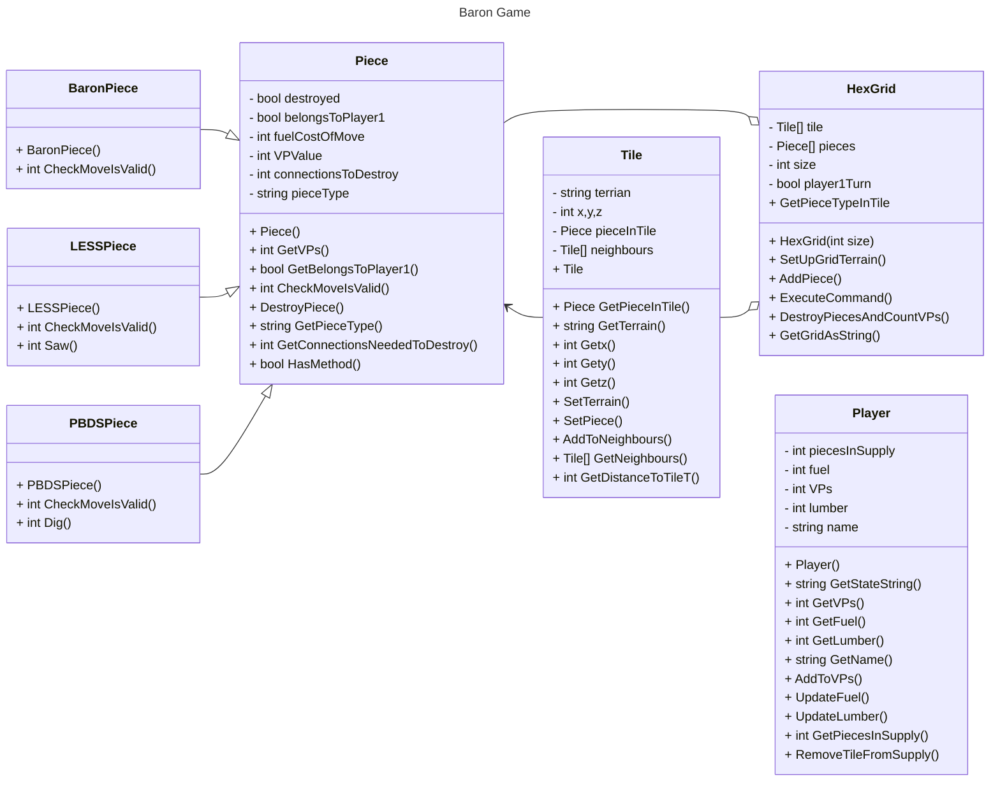

# Program Analysis

Program uses traditional procedural approach to its main program.  This is within the class **program**

## Class Program

This consists a number of static subroutines.  As such this part of the over system will behave in a classical *procedural* manner

- Main -
    - Object Initalisation
    - Main menu
        - DisplayMenu().  Writes menu options to console
        - Then processes option 
            - Load.  Calls *LoadGame()* and then *PlayGame()*
            - Default Game.  Calls *SetUpDefaultGame*  then call *PlayGame()*
            - Quit.  Exits main loop and ends main

- DisplayMenu.  Procedure to output a menu 
- DisplayEndMessages.  Display end of game messages regards winner and scores.
- LoadGame.  Loads a game from a text file inputted by user.  If invalid then sets up a empty game and returns a failure code.
- SetUpDefaultGame.  Create a standard game board with constants value (so no randomisation of setup)

- PlayGame. Main game playing loop

### PlayGame()
This is the core procedure in the program for playing a single game.  

```
Init variables
REPEAT
    FOR 1 to 3
        INPUT player commands
    NEXT
    FOR 1 to 3
        IF CheckCommandIsValid() THEN
            process command
        ENDIF
    NEXT
    UpdateBoard and scores
    Check if gameover
    OUTPUT board
    OUTPUT gameStatus
UNTIL gameover
```

There are 4 functions that appear to provide validation of user input prior to calls to the main objects to action player moves.  The initial function called is *CheckCommandIsValid*
- CheckMoveCommandFormat        - related to the *move* command
- CheckStandardCommandFormat    - related to the *spawn* command
- CheckUpgradeCommandFormat     - related to the *upgrade* command
- CheckCommandIsValid
The commands *saw* and *dig* do not appear to have any initial validation

## Other Classes

The program also has a number of proper classes.  The key ones are

- Player.  2 objects created,  one for each player
- HexGrid. 1 object created which represents the playing board

Other classes are 
- Piece.  This class is an outline class for a players piece.  It is used as a template for 3 other classes
    - BaronPiece
    - LESSPiece (Wood cutter)
    - PBDSPiece (Peat cutter)
    - Piece itself seems to be used for the Serf piece

- Tile.  Each object of this class represents a single board tile.  It is accessed via a list within a Grid object.

