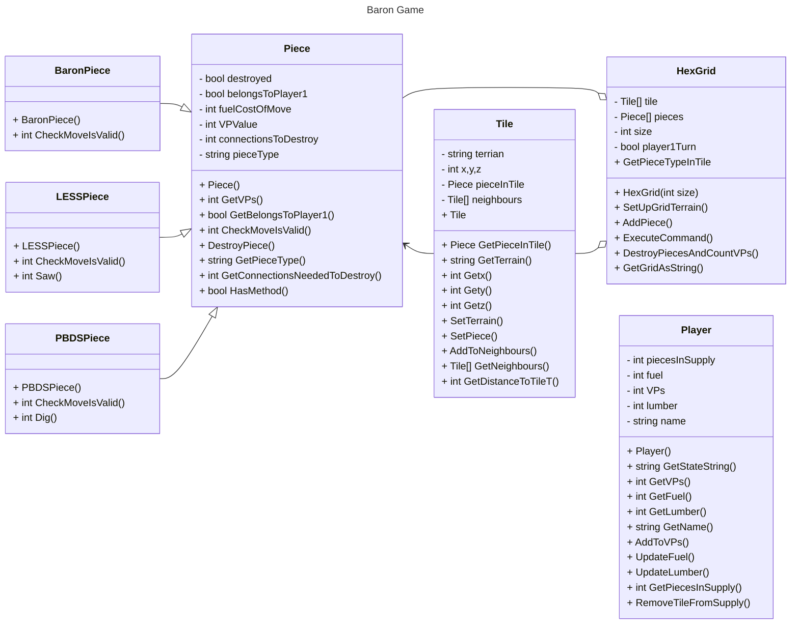

# Program Analysis

Program uses traditional procedural approach to its main program.  This is within the class **program**

## Class Program

This consists a number of static subroutines.  As such this part of the over system will behave in a classical *procedural* manner

- Main -
    - Object Initalisation
    - Main menu
        - DisplayMenu().  Writes menu options to console
        - Then processes option 
            - Load.  Calls *LoadGame()* and then *PlayGame()*
            - Default Game.  Calls *SetUpDefaultGame*  then call *PlayGame()*
            - Quit.  Exits main loop and ends main

- DisplayMenu.  Procedure to output a menu 
- DisplayEndMessages.  Display end of game messages regards winner and scores.
- LoadGame.  Loads a game from a text file inputted by user.  If invalid then sets up a empty game and returns a failure code.
- SetUpDefaultGame.  Create a standard game board with constants value (so no randomisation of setup)

- PlayGame. Main game playing loop

### PlayGame()
This is the core procedure in the program for playing a single game.  

```
Init variables
Grid = NEW HexGrid 
Player1 = NEW Player
Player2 = NEW Player
player1Turn = TRUE
commands = []               //list to hold command strings
REPEAT
    OUTPUT Grid.GetGridAsString()           //output the board to screen
    FOR 1 to 3
        INPUT cmd
        commands.add cmd            //add command to list of cmds
    NEXT
    FOREACH c IN commands           //c is the command being processed
        validCommand = CheckCommandIsValid(c)
        IF NOT validCommand THEN
            OUTPUT "Invalid Command"
        ELSE
            IF player1Turn THEN
                SummaryofResult=Grid.ExecuteCommand(c)     
                Player1.UpdateLumber()       
                Player1.UpdateFuel()
                IF a new tile is placed THEN
                    Player1.RemoveTileFromSupply()
                ENDIF
            ELSE
                SummaryofResult=Grid.ExecuteCommand(c)     
                Player2.UpdateLumber()       
                Player2.UpdateFuel()
                IF a new tile is placed THEN
                    Player2.RemoveTileFromSupply()
                ENDIF
            ENDIF
            OUTPUT SummaryofResult
        ENDIF
    NEXT

    gameOver = grid.DestroyPiecesAndCountVP()          //update board positions and determine if gameover

    OUTPUT gameStatus
    player1Turn = NOT player1Turn       //flip between players
UNTIL gameover
OUTPUT Grid.GetGridAsString     //output board to console
DisplayEndMessages()
```

There are 4 functions that appear to provide validation of user input prior to calls to the main objects to action player moves.  The initial function called is *CheckCommandIsValid*
- CheckMoveCommandFormat        - related to the *move* command
- CheckStandardCommandFormat    - related to the *spawn* command
- CheckUpgradeCommandFormat     - related to the *upgrade* command
- CheckCommandIsValid
The commands *saw* and *dig* do not appear to have any initial validation

## Other Classes

The program also has a number of proper classes.  The key ones are

- Player.  2 objects created,  one for each player
- HexGrid. 1 object created which represents the playing board

Other classes are 
- Piece.  This class is an outline class for a players piece.  It is used as a template for 3 other classes
    - BaronPiece
    - LESSPiece (Wood cutter)
    - PBDSPiece (Peat cutter)
    - Piece itself seems to be used for the Serf piece

- Tile.  Each object of this class represents a single board tile.  It is accessed via a list within a Grid object.



# Notes

1) The Piece class is the basis for the other piece classes which all inherit from it.  It is also used for the "Serf" piece.  
2) The playing pieces are held in an array (of class Piece) which is stored in the HexGrid object.  
3) A **references** to each Piece object is also stored in the relevant **Tile** object

