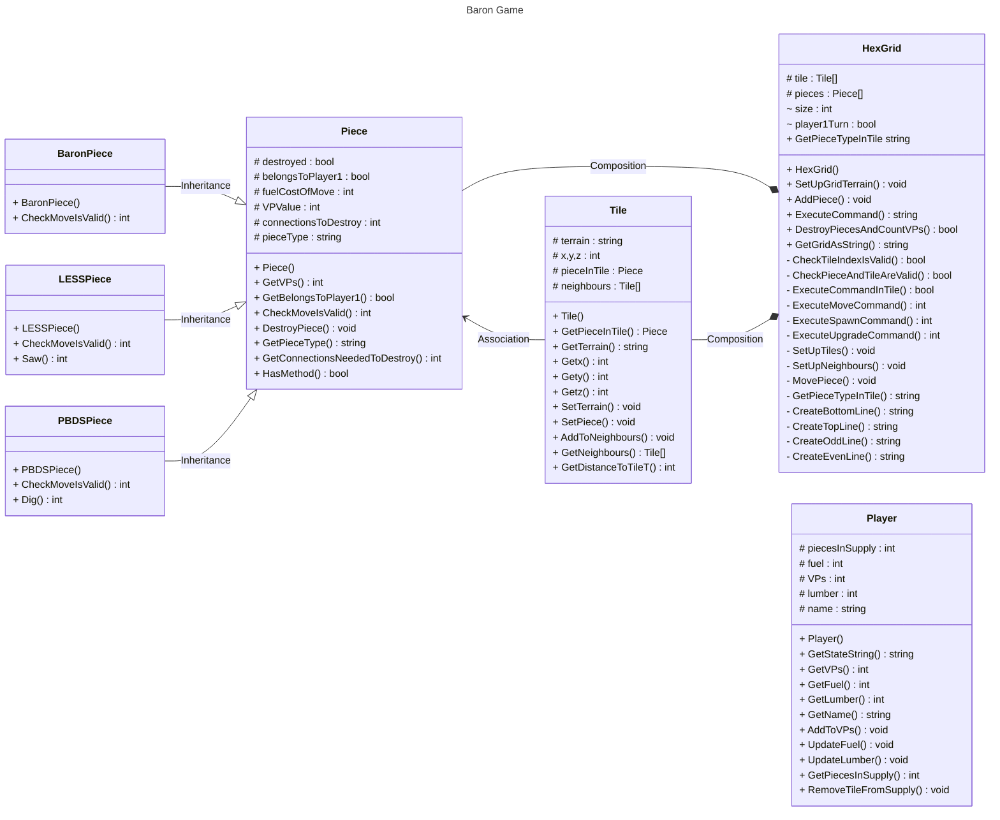

# Program Analysis

The overall program can be split into 2 main sections.  There is a static class called **Program** and then a set of other classes. As Program is static it functions very much like a traditional procedural program.  The initial starting subroutine is **Main**.

## Other Classes

The program also has a number of *proper* classes.  The key ones are

- Player.  2 objects created,  one for each player
- HexGrid. 1 object created which represents the playing board

Other classes are 
- Piece.  This class is an outline class for a players piece.  It is used as a template for 3 other classes
    - BaronPiece
    - LESSPiece (Wood cutter)
    - PBDSPiece (Peat cutter)
    - Piece itself seems to be used for the Serf piece

- Tile.  Each object of this class represents a single board tile.  It is accessed via a list within a Grid object.

## Object Model

## Detailed Documentation

### [Program Class](./Documentation%20of%20Class%20Program.md)  
### [HexGrid and Tile Classes](./Documentation%20of%20HexGrid%20and%20Tile%20Classes.md)  
### [Piece Classes](./Documentation%20of%20Piece%20Classes.md)
 
 
## Notes

1) The Piece class is the basis for the other piece classes which all inherit from it.  It is also used for the "Serf" piece.  
2) The playing pieces are held in an array (of class Piece) which is stored in the HexGrid object.  
3) A **references** to each Piece object is also stored in the relevant **Tile** object

